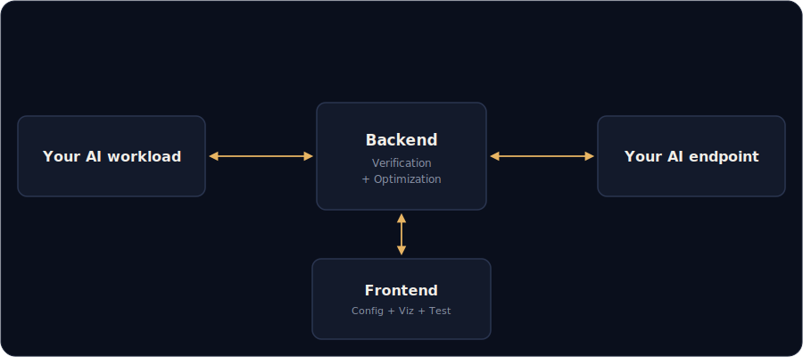

# Coloma

### The Continuous Verification and Optimization layer for self-hosted LLMs


[](https://www.apache.org/licenses/LICENSE-2.0.txt)
[](https://x.com/tschillaciML)

## Features

- Tune vLLM deployments to maximize the metrics you care about, and prevent runtime crashes.
- Compare your tuned models, and deploy them.
- Drop-in OpenAI-compatible proxy: sits between your workload and your endpoint.
- Live and saved traffic inspection.
- Image optimization: optimizes base64 images before they hit your GPU, shrinking payload with no client changes.
- Structured-output schema validation and custom Python validators.
- Idle-compute verification: re-runs a heavier check on past predictions when the proxy is idle, no added latency.
- Chat interface.
- **Runs 100% on-prem, no data collected / sent to third-party**, except if you use an LLM provider instead of a self-hosted model.

## Prerequisites

- [uv](https://docs.astral.sh/uv/)
- [node 24](https://nodejs.org/en/download)
- [Docker Engine](https://docs.docker.com/engine/install/)
- [NVIDIA Container Toolkit](https://docs.nvidia.com/datacenter/cloud-native/container-toolkit/latest/install-guide.html)
- [(Optional) Poppler for PDF import](https://poppler.freedesktop.org/)

## Quickstart

```bash
cp backend/.env.template backend/.env  # Then edit the file
uv sync
npm i
npm run build
npm run start  # Exposes on http://localhost:4173 and http://0.0.0.0:4173
```

Then head to Profile & deploy, after profiling and deploying, enjoy the Chat tab, proxy for your OpenAI client, and Traffic tab.

## Architecture



## Configuration

- COLOMA_API_KEY protects both the dashboard and proxy
- If you're using Coloma to deploy models, the API key field in Proxy settings is used to protect the OpenAI endpoint of your deployed model
- If you're using Coloma to point to LLM providers (e.g. OpenAI API), set your OpenAI API key in Proxy settings

## Roadmap

- Better support for VLM profiling.
- Reasoning models support, with higher reasoning effort on verification passes.
- Latency-aware fidelity tuning: profile per-domain latency and accuracy, then hold the highest image fidelity that fits your end-to-end latency budget.
- Feedback fusion: support human feedback, merge with schema validation and verification.
- Track inference server metrics.

## Community

Come hangout on [our Discord](https://discord.gg/kxtxsnmkba)!

Running open-weight inference in production? I want to hear what you're running!
[@tschillaciml](https://x.com/tschillaciml) [thomas@colomalabs.ai](mailto:thomas@colomalabs.ai)

Leave a star if this is helpful ♥️
